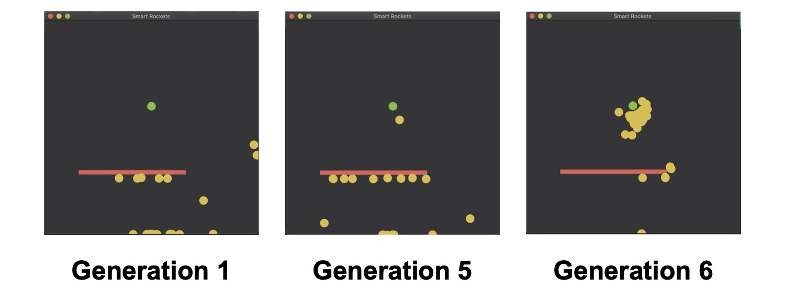

# Smart rockets

Implementation of *smart rockets* (see projects [here](http://blog.blprnt.com/blog/blprnt/project-smart-rockets) and [here](https://thecodingtrain.com/CodingChallenges/029-smartrockets.html)) in functional programming in Scala.

**Note:** The code is not totally written in pure functional programming, I am still learning the paradigms behind it.

**Author:** Vincent Barbosa Vaz

## Motivation

This project has been done for the course [DSIA-5201C](https://github.com/kydos/2019-ESIEE-DSIA-5101C) at [ESIEE Paris](https://www.esiee.fr/) during my final year of my MSc in 2019. This course is an introduction to Functional Programming and Scala programming language. The course is conducted by Professor [Angelo Corsaro](https://github.com/kydos/).

I choose to implement a genetic algorithm to know more about this subject that interests me a lot.

## Screenshots

- **Generation 1:** no rocket reaches the target
- **Generation 5:** one rocket managed to reach the target
- **Generation 6:** the other rockets reach the target too

## Dependencies

- [Scala](https://www.scala-lang.org/)
- [sbt](https://www.scala-sbt.org/)
- [ScalaFX](http://www.scalafx.org/)
- [Java](https://www.oracle.com/technetwork/java/javase/downloads/index.html) (JDK 1.8 or higher)

## Running the project

1. **cd** into **smart-rockets**.
2. Run **sbt**. This will open up the sbt console.
3. Type **~run**. The **~** is optional and causes sbt to re-run on every file save, allowing for a fast edit/run/debug cycle.

## Related projects

- Jer Thorp, ["Smart Rockets"](http://blog.blprnt.com/blog/blprnt/project-smart-rockets), 2006
- Daniel Shiffman, The Coding Train ["Smart Rockets in p5.js"](https://thecodingtrain.com/CodingChallenges/029-smartrockets.html)
